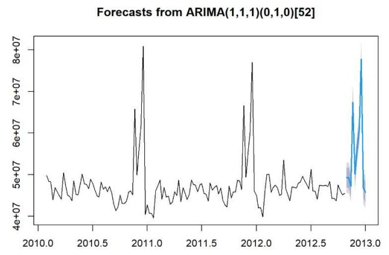

# Walmart Weekly Sales Forecasting

## 1. Forecasting Question

**What will be the total sales across all Walmart stores for each of the 10 weeks following the end of the dataset?**

The goal is to forecast Walmart's combined weekly sales and use those predictions to support business decisions such as:

- **Inventory Planning:** Prepare enough products for expected demand.
- **Revenue Planning:** Set realistic sales and revenue targets.
- **Workforce Planning:** Allocate staff and logistics resources during busy periods.
- **Seasonal Planning:** Prepare for higher sales around holidays and major shopping periods.

## 2. Understanding the Dataset

The dataset contains weekly sales information for Walmart stores across the United States from **2010 to 2012**.

Each row represents **one Walmart store during one week**. The data includes sales as well as economic and environmental factors that could affect customer spending.

### Dataset Features

| Feature | What it means |
|---|---|
| `Store` | Unique ID for each Walmart store |
| `Date` | Week-ending date |
| `Weekly_Sales` | Total sales for that store during that week |
| `Holiday_Flag` | `1` if the week included a major holiday, otherwise `0` |
| `Temperature` | Average temperature during the week in Fahrenheit |
| `Fuel_Price` | Average fuel price during the week |
| `CPI` | Consumer Price Index, which tracks changes in prices |
| `Unemployment` | Regional unemployment rate |

For forecasting, the weekly sales from all available stores were combined to create **one total sales value for each week**.

## 3. Exploratory Data Analysis

### Seasonal Sales Patterns

The sales data shows clear seasonal patterns.

Sales generally remain between **$40 million and $55 million** during normal weeks, but there are large increases around the holiday shopping season.

Two major spikes can be seen near the end of **2010 and 2011**, which are consistent with periods such as Thanksgiving, Black Friday, and Christmas.

Sales also tend to decline after these peaks, suggesting a post-holiday slowdown in customer spending.

### Autocorrelation

The first lag shows strong positive autocorrelation. In simple terms, **sales in one week are strongly related to sales in the following week**.

This indicates that previous sales patterns contain useful information for predicting future sales.

## 4. Forecast Accuracy

### Mean Absolute Percentage Error (MAPE)

**MAPE (Mean Absolute Percentage Error)** measures how far predicted sales are from actual sales, expressed as a percentage.

A lower MAPE means the model's predictions are closer to the actual values.

For example, a MAPE of 5% means the predictions are approximately 5% away from actual sales on average.

MAPE was used as the primary measure for comparing the forecasting models.

## 5. Forecasting Methods

Four forecasting methods were evaluated.

### Naive Forecast

The Naive method assumes that the next forecast will be the same as the most recently observed value.

The residuals generally fluctuate around zero, but the model has large forecast errors.

**MAPE: 100%+**

The model provides a useful baseline but does not adequately capture Walmart's seasonal sales patterns.

### Simple Exponential Smoothing (ETS)

ETS gives greater importance to recent observations when making forecasts.

The residuals fluctuate around zero, but the model still produces relatively large errors.

**MAPE: ~80%**

The main limitation is that the model does not explicitly account for seasonal sales patterns.

### Holt-Winters

Holt-Winters considers both **trend and seasonality** when forecasting sales.

The residuals fluctuate around zero, indicating that the model does not show a strong consistent overprediction or underprediction.

**MAPE: ~73.38%**

Holt-Winters performs better than the Naive and ETS approaches, but the forecast errors remain relatively large.

### ARIMA

ARIMA (AutoRegressive Integrated Moving Average) uses historical patterns and relationships between past observations to predict future sales.

The forecast continues to reflect the historical sales pattern, including expected fluctuations during the holiday period.

The residuals fluctuate around zero without an obvious trend or repeating pattern.

### ARIMA Residual Analysis

The ARIMA residuals provide several useful insights:

- **Random fluctuations:** Residuals generally move around zero, suggesting the model captures the main sales patterns.
- **Large spikes:** Some unusual weeks have larger errors, potentially reflecting promotions, holidays, or other unexpected events.
- **Stable variance:** The size of the errors remains relatively consistent over time.
- **No obvious pattern:** There is no major remaining trend or cycle in the residuals.

These results suggest that ARIMA captures most of the important time-based patterns in the sales data.

## 6. Model Comparison

| Model | MAPE | RMSE | Bias (MPE) | Summary |
|---|---:|---:|---:|---|
| Naive | 100%+ | High | Negative | Simple baseline |
| ETS | ~80% | High | Negative | Does not capture seasonality well |
| Holt-Winters | 73.38% | High | Negative | Captures trend and seasonality |
| **ARIMA** | **~1.7%** | **Low** | **~0.3%** | Strongest performance in this analysis |

### Key Finding

ARIMA produced a **MAPE of approximately 1.7%**, substantially lower than the other methods tested.

The model also had very low bias, with an MPE of approximately **0.3%**, meaning its forecasts were not consistently too high or too low.

The MASE was below 1, indicating that ARIMA performed better than the simple baseline methods used for comparison.

## 7. Final 10-Week Forecast

The ARIMA model was used to forecast the 10 weeks following the end of the historical dataset.

| Week | Forecasted Sales | 95% Confidence Interval | Month |
|---|---:|---:|---|
| 1 | $49.30M | $45.67M – $52.93M | Oct 2012 |
| 2 | $49.24M | $45.52M – $52.96M | Oct 2012 |
| 3 | $47.22M | $43.48M – $50.96M | Oct 2012 |
| 4 | $67.38M | $63.62M – $71.14M | Nov 2012 |
| 5 | $50.18M | $46.39M – $53.96M | Nov 2012 |
| 6 | $56.35M | $52.55M – $60.15M | Nov 2012 |
| 7 | $60.87M | $57.05M – $64.69M | Nov 2012 |
| 8 | **$77.78M** | $73.94M – $81.62M | Dec 2012 |
| 9 | $46.83M | $42.97M – $50.68M | Dec 2012 |
| 10 | $45.74M | $41.86M – $49.62M | Jan 2013 |

### What the Forecast Shows

- Most weeks are expected to generate approximately **$45M-$61M** in combined sales.
- A significant increase is forecast for **November**, with one week reaching approximately **$67M**.
- The largest predicted spike is approximately **$77.8M in December 2012**, consistent with the historical holiday sales pattern.
- Sales are expected to decline to approximately **$45.7M** by the final forecast week in January 2013.
- The 95% confidence intervals show the range in which the actual sales value may reasonably fall.

## 8. Business Recommendations

### Inventory Planning

Increase inventory and replenishment efforts ahead of weeks where sales are forecast to exceed **$65M**, particularly around the holiday period.

### Workforce Planning

Schedule additional employees and logistics resources during forecasted high-sales weeks to handle increased customer demand.

### Revenue Planning

The forecasted sales average approximately **$55M per week**, corresponding to roughly **$550M in combined sales over the 10-week forecast period**.

### Seasonal Planning

The strong holiday-related spikes demonstrate the importance of preparing inventory, staffing, and operations before major shopping periods.

## 9. Conclusion

The analysis shows that Walmart's weekly sales contain clear **trend, seasonal, and time-dependent patterns**.

Among the four methods tested, **ARIMA produced the lowest MAPE at approximately 1.7%** and showed very low forecast bias.

The final forecast indicates relatively stable sales during normal weeks, with significant increases during the holiday shopping period.

Overall, the analysis demonstrates how historical sales data and time-series forecasting can help businesses make more informed decisions about **inventory, staffing, revenue planning, and seasonal preparation**.

## 10. Future Improvements

Future versions of the analysis could improve forecasting by:

- Using daily rather than weekly sales data
- Incorporating promotions and major holidays directly into the model
- Including external factors such as temperature, fuel prices, CPI, and unemployment
- Comparing ARIMA with additional statistical and machine learning models
- Building separate forecasts for individual stores or regions
