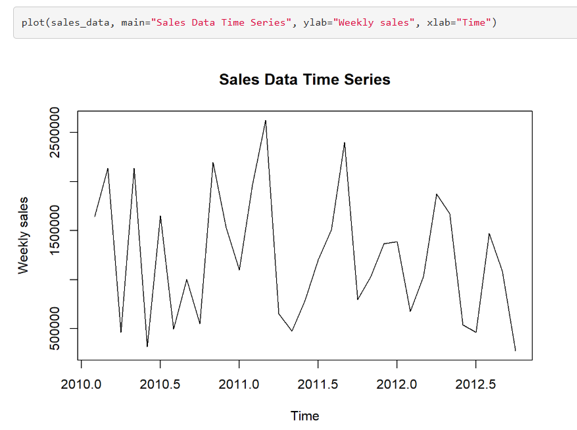
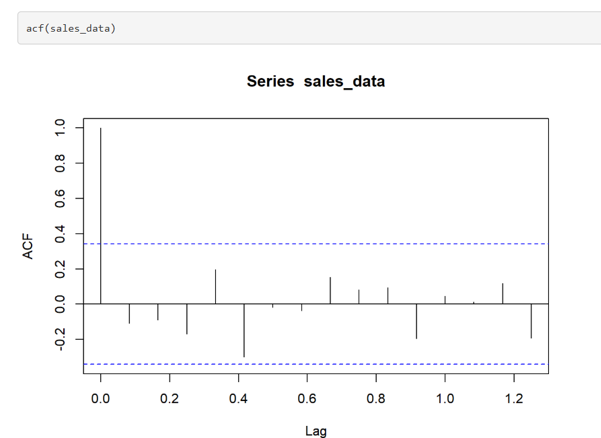
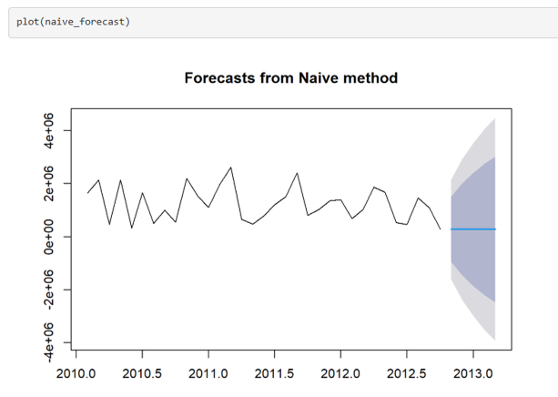
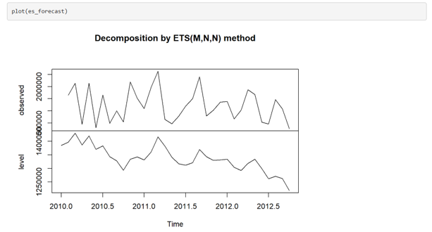
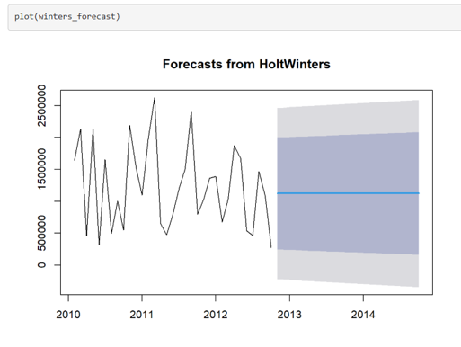

# Walmart Weekly Sales Forecasting

## Project Overview

This project uses historical weekly sales data from **45 Walmart stores** to forecast the **combined sales of all 45 stores for each of the 10 weeks after the final week in the dataset**.

Three forecasting methods were compared:

- Naive Forecast
- Simple Exponential Smoothing (ETS)
- Holt-Winters

## Business Question

**What will Walmart's total sales be for each of the 10 weeks following the last week in the dataset, after combining the sales of all 45 stores for each week?**

In other words, the goal is to predict 10 separate weekly sales totals, where each total represents the sales generated by all 45 Walmart stores during that week.

These forecasts can help with:

- Inventory planning
- Revenue targets
- Staffing decisions
- Marketing and promotional planning
- Preparing for seasonal demand

## Dataset

The dataset contains weekly sales information from **45 Walmart stores across the United States**, covering approximately **2010 to 2012**.

Each row represents one store's sales for a specific week, along with several factors that may influence sales.

### Dataset Features

| Feature | Description |
|---|---|
| `Store` | Unique ID for each Walmart store |
| `Date` | Week-ending date |
| `Weekly_Sales` | Sales generated by the store during that week |
| `Holiday_Flag` | `1` if the week includes a major holiday, otherwise `0` |
| `Temperature` | Average temperature during the week |
| `Fuel_Price` | Average fuel price during the week |
| `CPI` | Consumer Price Index, reflecting changes in prices |
| `Unemployment` | Regional unemployment rate |

### Why These Variables Matter

Sales can be affected by several factors:

- **Holidays** can increase customer spending.
- **Temperature** can influence shopping behavior and product demand.
- **Fuel prices** can affect transportation costs and consumer spending.
- **CPI** reflects changes in the overall cost of goods and services.
- **Unemployment** can affect consumers' purchasing power.

## Exploratory Data Analysis

### Overall Sales Trend

The data shows an **overall upward trend in sales** from 2010 to 2012, along with recurring increases and decreases throughout the year.

These repeated patterns suggest that Walmart sales have **seasonality**, meaning certain periods of the year tend to have consistently higher or lower sales.

### Autocorrelation

The ACF measures how strongly sales in one week are related to sales from previous weeks.

The first lag shows strong positive autocorrelation, indicating that **sales in one week are strongly related to sales in the following week**.

This suggests that historical sales can provide useful information for forecasting future sales.

## Forecasting Methods

### 1. Naive Forecast

The Naive method assumes that the next week's sales will be the same as the most recent week's sales.

**MAPE: >100%**

The method is useful as a simple baseline, but it does not account for changes in trend or seasonal patterns.

### 2. Simple Exponential Smoothing

Simple Exponential Smoothing gives more weight to recent sales when making predictions.

**MAPE: ~80%**

This method can respond to recent changes in sales but does not explicitly model seasonal patterns.

### 3. Holt-Winters

Holt-Winters considers both:

- **Trend:** Whether sales are increasing or decreasing over time
- **Seasonality:** Repeating patterns that occur at regular intervals

**MAPE: ~73.38%**

Holt-Winters produced the lowest error among the three methods tested.

## What is MAPE?

**MAPE (Mean Absolute Percentage Error)** measures how far forecasted values are from actual values, expressed as a percentage.

A lower MAPE means the predictions are generally closer to the actual sales.

For example, a MAPE of 10% means the forecast differs from actual sales by about 10% on average.

## Results

| Forecasting Method | MAPE | Description |
|---|---:|---|
| Naive | >100% | Uses the most recent sales value |
| ETS | ~80% | Gives more weight to recent sales |
| **Holt-Winters** | **~73.38%** | Captures trend and seasonality |

### Key Finding

Among the three methods tested, **Holt-Winters produced the lowest MAPE** and was selected for the 10-week forecast.

This suggests that accounting for both **trend and seasonal patterns** was useful for forecasting the combined weekly sales in this dataset.

## Business Takeaways

The 10-week forecast can provide an estimate of expected combined sales across Walmart stores.

Businesses could use these forecasts to:

- Plan inventory based on expected demand
- Set short-term revenue targets
- Adjust staffing levels
- Prepare for seasonal sales changes
- Plan marketing and promotional activities

## Future Improvements

The forecast could potentially be improved by:

- Using **daily sales data** for more detailed predictions
- Including holidays and promotional events directly in the model
- Incorporating factors such as temperature, fuel prices, CPI, and unemployment
- Comparing Holt-Winters with additional statistical and machine learning models

## Tools Used

- **R**
- Time-Series Forecasting
- Holt-Winters
- Exponential Smoothing
- Autocorrelation Analysis
- Data Visualization
- Statistical Analysis
